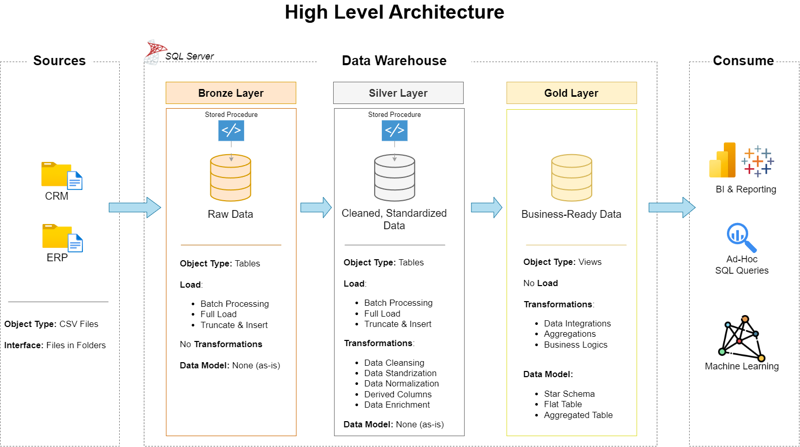

# Data Warehouse and Analytics Project
This project showcases a complete data warehousing and analytics solution, from constructing a data warehouse to deriving actionable insights. As a portfolio project, it emphasizes industry best practices in data engineering and analytics, transforming raw data into valuable insights that support informed, data-driven decisions.

---

## Project Overview
The scope of this project includes:

1. **Data Architecture**: Setting up a modern data warehouse using Medallion Architecture, organizing data into Bronze, Silver, and Gold layers.
2. **ETL Pipelines**: Extracting, transforming, and loading data from source systems into the warehouse for seamless integration.
3. **Data Modeling**: Developing fact and dimension tables to make analytical queries faster and efficient.
4. **Analytics & Reporting**: Building SQL-based reports and dashboards that turn raw data into valuable insights.

---

## Project Requirements
### Build Data Warehouse (Data Engineering)

#### Objective
Build a modern data warehouse with SQL Server to bring sales data together, making analytics and smarter decision-making easier.

#### Specifications
- **Data Sources**: Import sales data from ERP and CRM systems, provided in CSV format.
- **Data Quality**: Perform cleansing and address data quality issues before analysis to ensure accuracy.
- **Integration**: Merge both datasets into a single, intuitive data model optimized for analytical queries.
- **Scope**: Focus exclusively on the most recent dataset, historical data storage is not required.
- **Documentation**: Provide clear documentation of the data model to support business users and analytics teams.

---

### Business Intelligence: Analytics & Reporting (Data Analysis)

#### Objective
Develop SQL-driven analytics and data visualization using Power BI to uncover valuable insights into:
- **Sales Trends**
- **Product Performance**
- **Customer Behavior**

These insights provide stakeholders the key business metrics they need to make smart, strategic decisions.  

---

## Data Architecture

The data architecture for this project is built on Medallion Architecture, using Bronze, Silver, and Gold layers:

1. **Bronze Layer**: Holds raw data exactly as it comes from source systems. CSV files are loaded into the SQL Server database.
2. **Silver Layer**: Cleans, standardizes, and normalizes the data to get it ready for analysis.
3. **Gold Layer**: Stores business-ready data, structured in a star schema for reporting and analytics.

## High Level Architecture

