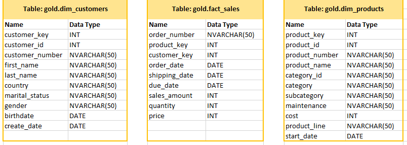
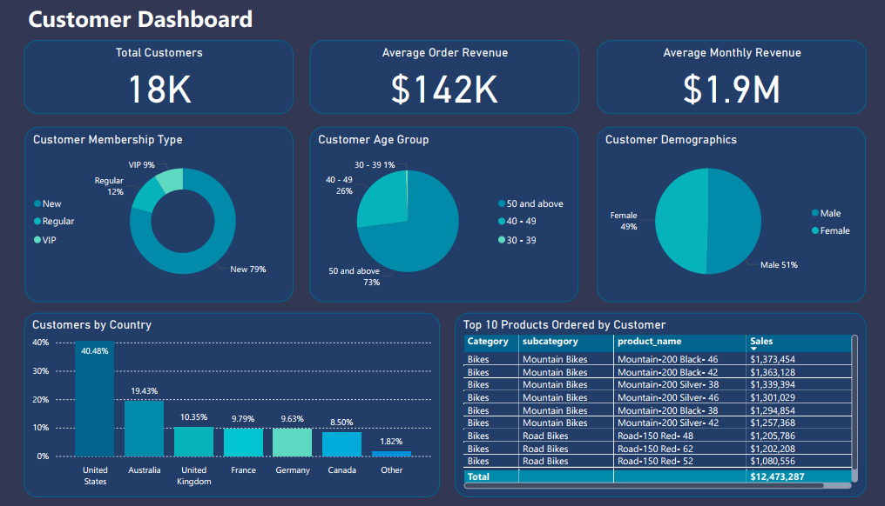

# The Ride Hub - Data Warehouse & Analytics Project

## Project Background

Established in 2010, The Ride Hub has been a cornerstone of the cycling community, providing top-quality bicycles, accessories, and clothing to riders of all levels. Whether it’s high-performance bikes, essential accessories, or stylish and functional apparel, the shop prides itself on delivering quality, innovation, and reliability. The business uses different operational systems for Customer Relationship Management (CRM) and Enterprise Resource Planning (ERP). To create a unified view of the business, provide a single source of truth for reporting and analysis, data will be integrated and organized within a data warehouse. 

This project showcases a complete data warehousing and analytics solution, from constructing a data warehouse to deriving actionable insights. It emphasizes industry best practices in data engineering and analytics, transforming raw data into valuable insights that support informed, data-driven decisions.

---

## Project Objectives

1. **Data Architecture**: Setting up a modern data warehouse using Medallion Architecture, organizing data into Bronze, Silver, and Gold layers.
2. **ETL Pipelines**: Extracting, transforming, and loading data from source systems into the warehouse for seamless integration.
3. **Data Modeling**: Developing fact and dimension tables to make analytical queries faster and efficient.
4. **Analytics & Reporting**: Building SQL-based reports that turn raw data into valuable insights.
5. **Analytics Dashboard**: Building an interactive data visualization dashboard in Power BI to display, track, and analyse key performance indicators (KPIs) and metrics.

---

## Project Requirements
### 1. Build Data Warehouse (Data Engineering)

Build a modern data warehouse with SQL Server to bring sales data together, making analytics and smarter decision-making easier.

- **Data Sources**: Import sales data from ERP and CRM systems, provided in CSV format.
- **Data Quality**: Perform cleansing and address data quality issues before analysis to ensure accuracy.
- **Integration**: Merge both datasets into a single, intuitive data model optimized for analytical queries.
- **Scope**: Focus exclusively on the most recent dataset, historical data storage is not required.
- **Documentation**: Provide clear documentation of the data model to support business users and analytics teams.

### 2. Business Intelligence: Analytics & Reporting (Data Analysis)

Develop SQL-driven analytics and data visualization using Power BI to uncover valuable insights. These insights provide stakeholders the key business metrics they need to make smart, strategic decisions.  

- **Sales Trends**
- **Product Performance**
- **Customer Behavior**

---

## Data Architecture & Data Flow Diagram

The data architecture for this project is built on **Medallion Architecture**, using **Bronze**, **Silver** and **Gold** layers:

1. **Bronze Layer**: Holds raw data exactly as it comes from source systems. CSV files are loaded into the SQL Server database.
2. **Silver Layer**: Cleans, standardizes, and normalizes the data to get it ready for analysis.
3. **Gold Layer**: Stores business-ready data, structured in a star schema for reporting and analytics.

The SQL queries for creating database called **DataWarehouse** and schemas for **Bronze**, **Silver** and **Gold** can be found [here](scripts/database_and_schemas/create_database_and_schemas.sql)

         

- The SQL queries to create tables and import data in the **Bronze Layer** from **CRM & ERP csv** can be found [here](scripts/bronze_layer)
- The SQL queries to create tables and import data in the **Silver Layer** from **Bronze Layer** can be found [here](scripts/silver_layer)
- The SQL queries to create dimension and fact view in the **Gold Layer** for **Customers**, **Products** and **Sales** can be found [here](scripts/gold_layer)
- The SQL queries used for **Data Validation & Testing** across the layers can be found [here](data_validation_and_testing)
  
---

## Data Structure & Data Type

The Ride Hub's database structure consists of three tables: **Sales**, **Customers** and **Products**. 

At the business level, the Gold Layer organizes data for effective analysis and reporting, featuring dimension tables and fact tables that define key business metrics.

---

## Analytics & Reporting (SQL & Power BI)

This report provides an in-depth analysis of sales, products and customer data, focusing on significant trends, insights, and performance metrics over the period from **2010 to 2014**. The aggregated findings reveal critical patterns related to sales performance by year, category, and geographic breakdown, alongside customer acquisition trends and product performance. 

**Key Findings:**

- Total sales reached **$29.4 million** with a profit margin of **$6.8 million**.
- The majority of customers belong to the New membership type **(79%)**.
- Bikes continues as the highest-selling category **(90%)**, contributing significantly to overall revenue.
- The United States represents the largest customer base, accounting for **40.48%** of total sales.

Insights and recommendations are provided on the following key areas:

- **Sales Trends**
- **Product Performance**
- **Customer Behavior**

The SQL queries used to create **Reports and Analytics** can be found [here](reports_and_analytics)

An interactive Power BI dashboard can be downloaded here [Sales Dashboard](power_bi/Sales_Dashboard.pbix) & [Customer Dashboard](power_bi/Customer_Dashboard.pbix)

---

## **Sales Trends**

The dataset reveals an overall positive trend in sales, with total sales reaching **$29.4 million** and profits of **$11.7 million** against costs of **$17.7 million**.

### Sales vs. Profit vs. Cost (by Year)

The sales were notably low, **$0.1 million** in 2010 as the business established end of 2010. 

In 2011, sales were **$7.1 million** and profits were relatively lower at **$2.8 million**. By 2013, total sales peaked at **$16.3 million**, with profits showing a significant increase to **$6.8 million**. The cost of sales rose alongside sales and profits illustrating the relationship between cost management and profit margins. The cost was **$4.3 million** in 2011 and **$9.6 million** in 2013.

**$0.1 million** sales recorded till date for 2014, business year is in progress.

### Sales by Product 

Sales categories include **Bikes, Accessories, and Clothing**. **Bikes** remain the highest sales contributor in all years, accounting for **90%** of the sales at **$15.4 million** in 2013, indicating strong market demand followed by accessories and clothing. Accessories is gradually increasing sales, reflecting an engagement in up-selling and cross-selling strategies. Clothing shows a steady increase and reflects market interest.

### Sales by Country

The **United States** and **Australia** are the **two leading markets** for sales, together comprising a significant portion of total revenues at **$9.2 million** and **$9.1 million** respectively. Whereas, sales is noticeably **low in European market** like **Germany $2.9 million** and **France $2.6 million** highlighting potential areas for increased marketing and expansion efforts. 
United States dominates the customer base, which may influence shipping, marketing, and sales strategies for different regions. The overall data indicates strong sales performance, particularly in the bike category and within the United States.

### Customer Demographics

The dataset reveals a total of **18,000 customers** with a notable average order revenue of **$142K**. The average monthly revenue generated is **$1.9 million**. The gender distribution appears balanced, with **51% male** and **49% female**. The predominant age group of customers falls into the **50 and above category (73%)**, with only **26% between the ages of 40 and 49** and **1% between the ages of 30 and 39**. The data shows a predominance of older customers, which may influence marketing strategies and product offerings, necessitating a focus on products that resonate with this demographic. This near-even split indicates that marketing strategies should target both genders to maximize outreach. 

### Customer Membership Types

The majority of customers are **new customers** at **79%**. The predominant share of new customers suggests a potential opportunity to convert more customers into **regular (12%)** or **VIP members (9%)**, which can enhance loyalty and increase revenue.
The minor percentage of VIP customers indicates potential for growth in loyalty programs. This portrays a healthy influx of new customers but also indicates a need for retention strategies. 

---

## Recommendations

- **Regional Marketing Strategies**: Tailor marketing efforts based on regional sales performance to maximize impact, particularly in high-performing countries. Focus on expanding sales in countries like Germany and France, which show potential for growth.

- **Strengthening Product Offerings**: Given the high sales of mountain bikes, look into expanding its inventory in this category, potentially introducing new models or offering product customization options or accessories that complement biking experiences could prove lucrative. Consider promotions for Accessories and Clothing to balance the product portfolio.

- **Product Diversification**: Invest in product development, especially in Accessories and Clothing categories that show growth potential.

- **Cost Management**: Implement cost control measures to improve profit margins.

- **Enhance Customer Retention Initiatives**: The high percentage of new customers highlights the need for customer retention. Focus on converting New and Regular customers to VIP status through loyalty programs.

- **Targeted Marketing**: Given the demographic breakdown, focus marketing efforts toward the 50+ age group with tailored messages that resonate with their interests and lifestyle. Develop targeted marketing campaigns for different age segments, particularly younger customers, to capture market share that has been overlooked.

- **Monitoring and Optimization**: Continuous analysis of sales trends, customer feedback, and market conditions would help refine strategies for sustained growth.

---

## Assumptions and Caveats
Throughout the analysis, multiple assumptions were made to manage challenges with the data. These assumptions and caveats are noted below:
- The collected data is complete and correct.
- According to the dataset, sales data for 2010 is available for December only and sales data for 2014 is available up to January only. Therefore, it has been assumed that the business was established in 2010 and business year remains in progress for 2014.
- Approximately 3% of the dataset contained missing or blank entries for country, year, and other fields. Additionally, some columns lacked any values. To ensure clarity, the data has been filtered appropriately in the report.

---

## References 

Here are the references that contributed to the completion of this project.

- [DataCamp](https://www.datacamp.com/)
   DataCamp offers interactive R, Python, Sheets, SQL and shell courses. All on topics in data science, statistics and machine learning.
  
- [Baraa Khatib Salkini](https://www.youtube.com/@DataWithBaraa)
  Baraa has over 15 years of experience in Data and Analytics. He is also a Content Creator who produces and shares educational videos on Data Science. His content includes real-world projects and practical explanations to enhance understanding.

